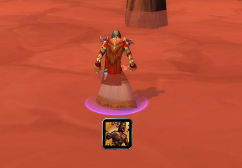
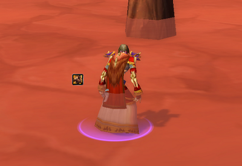
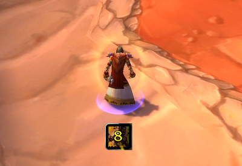
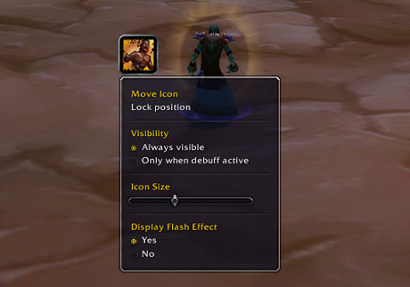

# Better Weakened Soul
TLDR: A small addon that improves Weakened Soul, by allowing you to change size and position.

Ever tried re-applying Power Word: Shield on yourself only to forget that the Weakend Soul debuff   is still active, wasting precious seconds and clicks?
Then look no further for the solution to this problem!   BetterWeakenedSoul allows you to reposition, and resize the Weakend Soul debuff to your preferences   so that you will never miss it again!

## Some possible configurations

 

## Works with OmniCC

<!-- 

    

 -->
 

## Customize
Position can be adjusted by left-clicking the icon and start dragging. The new postion will be automatically saved.
Right-click the icon to display the rest of the possible configurations. 

 

## Reset - /bwsreset
Typing /bwsreset in the chat will reset the icon's position to the middle of the screen, and toggle the visibility.
